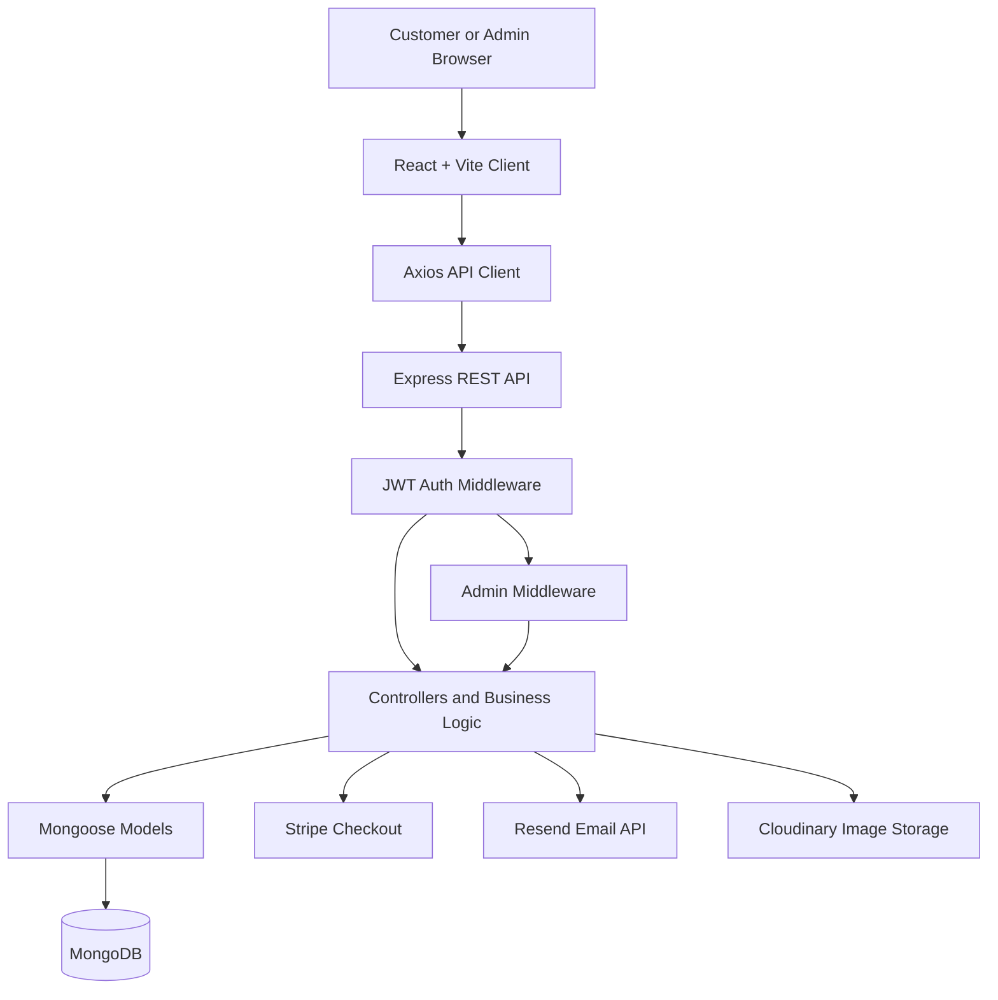

# KTMart

KTMart is a full-stack grocery and daily-needs shopping application. Customers can browse products, manage a cart and delivery addresses, and place cash-on-delivery or Stripe card orders. Administrators can manage catalog data and review all orders with customer and delivery information.

The project separates the user interface and API server into two applications:

- `client/`: React single-page application built with Vite.
- `server/`: Express API connected to MongoDB through Mongoose.

## Project Overview

### What It Does

KTMart provides an online storefront for:

- Browsing categories, subcategories, and products.
- Searching for products.
- Adding products to a personal cart and changing quantities.
- Saving, editing, and disabling delivery addresses.
- Completing checkout with cash on delivery or Stripe Checkout for card payments.
- Viewing personal order history.
- Managing catalog data and reviewing all orders as an administrator.

### Main Roles

| Role | Responsibilities |
|---|---|
| Customer | Register, verify an account, browse products, manage a cart and addresses, and place or review orders. |
| Administrator | Manage products and catalog screens in the frontend, and view all orders with customer and delivery details. |

### Main Workflow

1. A visitor registers or logs in.
2. The customer browses products by category, subcategory, or search.
3. Products are added to the authenticated customer cart.
4. The customer selects or saves a delivery address.
5. The customer chooses cash on delivery or Stripe Checkout.
6. The order is stored in MongoDB; successful Stripe payments are finalized and the cart is cleared.
7. The customer can view personal orders, while an administrator can view all orders.

## Key Features

| Feature | Description |
|---|---|
| Authentication | Registration, login, logout, email verification, JWT access/refresh tokens, and authenticated user details. |
| Password recovery | Forgot-password OTP verification and password reset flow. |
| Product discovery | Category and subcategory browsing, product details, and product search. |
| Cart | Add products, retrieve cart items, update quantities, and remove items. |
| Address book | Create, edit, retrieve, and disable delivery addresses. |
| Cash on delivery | Creates order records and clears the customer cart after order creation. |
| Stripe Checkout | Creates card-payment Checkout Sessions and finalizes paid sessions. Currency is configured as INR in the server checkout code. |
| Customer orders | Authenticated customers can view their own order history. |
| Admin catalog | Admin frontend screens support category, subcategory, product upload, and product management workflows. |
| Admin order view | Administrators can view all orders, customer contact data, products, payment data, and delivery addresses. |
| Image uploads | Multer receives images in memory and Cloudinary stores uploaded avatars and product/category images. |
| Email delivery | Resend is used by the backend for verification and password-related email messages. |
| Responsive interface | The React application includes desktop and mobile navigation/cart experiences. |

## Tech Stack

| Category | Technology |
|---|---|
| Frontend | React 19, React Router DOM, Vite |
| State management | Redux Toolkit, React Redux |
| Backend | Node.js ES modules, Express 5 |
| Database | MongoDB with Mongoose 8 |
| Authentication | JSON Web Tokens, bcryptjs, cookie-parser |
| APIs | REST-style Express routes consumed with Axios |
| Styling | Tailwind CSS, PostCSS, Autoprefixer, project CSS |
| Payments | Stripe Checkout and `@stripe/stripe-js` |
| Email | Resend |
| File storage | Cloudinary |
| Upload handling | Multer with memory storage |
| Security and logging | Helmet, CORS, Morgan |
| Tables and UI utilities | TanStack React Table, React Icons, React Hot Toast, SweetAlert2 |
| Deployment configuration | Vercel configuration for the server |

## System Architecture



## Repository Structure

```text
KTMart/
├── client/
│   ├── public/
│   └── src/
│       ├── assets/
│       ├── common/          # Shared API route definitions
│       ├── components/      # Reusable UI components
│       ├── hooks/           # React hooks
│       ├── layouts/         # Page layouts and admin permission wrapper
│       ├── pages/           # Application screens
│       ├── provider/        # Global data fetching and derived cart state
│       ├── route/           # React Router configuration
│       ├── store/           # Redux slices and store
│       └── utils/           # Client utilities
├── server/
│   ├── config/              # Database, email, Stripe configuration
│   ├── controllers/         # API request handlers
│   ├── middleware/          # Authentication, admin, and upload middleware
│   ├── models/              # Mongoose schemas
│   ├── route/               # Express route modules
│   └── utils/               # Email templates, tokens, and uploads
├── Demo 1.gif
├── Demo 2.gif
└── Thumnails.png
```

## Getting Started

### Prerequisites

Install the following before running the project:

- Node.js and npm.
- A MongoDB connection string.
- A Resend API key for email operations.
- Cloudinary credentials for image uploads.
- Stripe keys for online payments.

The repository does not contain Docker files or an `.env.example` file. Create local environment files manually and keep their values private.

### Install Dependencies

```bash
cd client
npm install

cd ../server
npm install
```

### Configure the Client

Create `client/.env` with the variable names used by the application:

```env
VITE_API_URL=<backend-api-base-url>
VITE_STRIPE_PUBLIC_KEY=<stripe-publishable-key>
```

`VITE_API_URL` is used as the Axios base URL. The Stripe public key is used by the client to redirect to Stripe Checkout.

### Configure the Server

Create `server/.env` with the variable names used by the backend:

```env
FRONTEND_URL=<frontend-origin>
MONGODB_URI=<mongodb-connection-string>
RESEND_API=<resend-api-key>
SECRET_KEY_ACCESS_TOKEN=<access-token-secret>
SECRET_KEY_REFRESH_TOKEN=<refresh-token-secret>
CLODINARY_CLOUD_NAME=<cloudinary-cloud-name>
CLODINARY_API_KEY=<cloudinary-api-key>
CLODINARY_API_SECRET_KEY=<cloudinary-api-secret>
STRIPE_SECRET_KEY=<stripe-secret-key>
STRIPE_ENPOINT_WEBHOOK_SECRET_KEY=<stripe-webhook-secret>
PORT=8080
```

`PORT` is optional and defaults to `8080`. The variable spellings `CLODINARY_*` and `STRIPE_ENPOINT_WEBHOOK_SECRET_KEY` match the current source code and must be kept unchanged unless the code is updated too.

### Run the Applications

Start the API server in one terminal:

```bash
cd server
npm run dev
```

Start the Vite development server in another terminal:

```bash
cd client
npm run dev
```

The exact frontend URL is printed by Vite. The backend exposes a root status endpoint at `/` and starts after establishing a MongoDB connection.

### Production Build

Build and preview the frontend:

```bash
cd client
npm run build
npm run preview
```

Start the backend without Nodemon:

```bash
cd server
npm start
```

### Available Scripts

#### Client

| Command | Purpose |
|---|---|
| `npm run dev` | Start the Vite development server. |
| `npm run build` | Create a production frontend build. |
| `npm run preview` | Preview the production frontend build. |
| `npm run lint` | Run ESLint. |

#### Server

| Command | Purpose |
|---|---|
| `npm run dev` | Start the API with Nodemon. |
| `npm start` | Start the API with Node.js. |
| `npm test` | Placeholder script that currently exits with an error; no automated test suite is configured. |

## Frontend Routes

The routes are defined in `client/src/route/index.jsx`.

| Route | Purpose |
|---|---|
| `/` | Home page. |
| `/search` | Product search. |
| `/login` | Login. |
| `/register` | Registration. |
| `/forgot-password` | Forgot-password screen. |
| `/verification-otp` | OTP verification screen. |
| `/reset-password` | Password reset screen. |
| `/user` | Mobile user menu. |
| `/dashboard/profile` | User profile. |
| `/dashboard/myorders` | Customer order history. |
| `/dashboard/address` | Customer saved addresses. |
| `/dashboard/category` | Admin category screen. |
| `/dashboard/subcategory` | Admin subcategory screen. |
| `/dashboard/upload-product` | Admin product upload screen. |
| `/dashboard/product` | Admin product management screen. |
| `/dashboard/all-orders` | Admin all-orders screen. |
| `/:category/:subCategory` | Product list for a category and subcategory. |
| `/product/:product` | Product details. |
| `/cart` | Cart page. |
| `/checkout` | Checkout. |
| `/success` | Successful order/payment page. |
| `/cancel` | Cancelled payment page. |

## Backend API

The server mounts route groups under `/api`. Protected routes require the access token in an HTTP-only cookie or an `Authorization: Bearer <token>` header. Admin-protected routes additionally require `user.role === "ADMIN"`.

### User: `/api/user`

| Method | Path | Protection | Purpose |
|---|---|---|---|
| POST | `/register` | Public | Register a user. |
| POST | `/verify-email` | Public | Verify an email address. |
| POST | `/login` | Public | Log in. |
| GET | `/logout` | Authenticated | Log out. |
| PUT | `/upload-avatar` | Authenticated | Upload a profile avatar. |
| PUT | `/update-user` | Authenticated | Update user details. |
| PUT | `/forgot-password` | Public | Request password recovery. |
| PUT | `/verify-forgot-password-otp` | Public | Verify the recovery OTP. |
| PUT | `/reset-password` | Public | Reset the password. |
| POST | `/refresh-token` | Public | Request a new access token. |
| GET | `/user-details` | Authenticated | Get the current user. |

### Catalog and files

| Group | Method | Path | Protection | Purpose |
|---|---|---|---|---|
| Category | POST | `/api/category/add-category` | Authenticated | Add a category. |
| Category | GET | `/api/category/get` | Public | List categories. |
| Category | PUT | `/api/category/update` | Authenticated | Update a category. |
| Category | DELETE | `/api/category/delete` | Authenticated | Delete a category. |
| Subcategory | POST | `/api/subcategory/create` | Authenticated | Create a subcategory. |
| Subcategory | POST | `/api/subcategory/get` | Public | List subcategories. |
| Subcategory | PUT | `/api/subcategory/update` | Authenticated | Update a subcategory. |
| Subcategory | DELETE | `/api/subcategory/delete` | Authenticated | Delete a subcategory. |
| File | POST | `/api/file/upload` | Authenticated | Upload an image. |
| Product | POST | `/api/product/create` | Authenticated + admin | Create a product. |
| Product | POST | `/api/product/get` | Public | List products. |
| Product | POST | `/api/product/get-product-by-category` | Public | List products by category. |
| Product | POST | `/api/product/get-pruduct-by-category-and-subcategory` | Public | List products by category and subcategory. |
| Product | POST | `/api/product/get-product-details` | Public | Get product details. |
| Product | PUT | `/api/product/update-product-details` | Authenticated + admin | Update a product. |
| Product | DELETE | `/api/product/delete-product` | Authenticated + admin | Delete a product. |
| Product | POST | `/api/product/search-product` | Public | Search products. |

The `get-pruduct-by-category-and-subcategory` spelling is the current route spelling in the source code.

### Cart, addresses, and orders

| Group | Method | Path | Protection | Purpose |
|---|---|---|---|---|
| Cart | POST | `/api/cart/create` | Authenticated | Add an item to a cart. |
| Cart | GET | `/api/cart/get` | Authenticated | Get the current user cart. |
| Cart | PUT | `/api/cart/update-qty` | Authenticated | Update cart quantity. |
| Cart | DELETE | `/api/cart/delete-cart-item` | Authenticated | Remove a cart item. |
| Address | POST | `/api/address/create` | Authenticated | Create an address. |
| Address | GET | `/api/address/get` | Authenticated | Get the current user addresses. |
| Address | PUT | `/api/address/update` | Authenticated | Update an address. |
| Address | DELETE | `/api/address/disable` | Authenticated | Disable an address. |
| Order | POST | `/api/order/cash-on-delivery` | Authenticated | Create cash-on-delivery order records. |
| Order | POST | `/api/order/checkout` | Authenticated | Create a Stripe Checkout Session. |
| Order | POST | `/api/order/payment-success` | Authenticated | Verify and finalize a paid Stripe session. |
| Order | POST | `/api/order/webhook` | Public webhook endpoint | Receive Stripe Checkout events. |
| Order | GET | `/api/order/order-list` | Authenticated | Get the current user orders. |
| Order | GET | `/api/order/all-orders` | Authenticated + admin | Get all orders with customer and address data. |

## Authentication and Authorization

- Passwords are hashed with `bcryptjs` before storage.
- Access tokens and refresh tokens are signed with separate environment secrets.
- Access tokens expire after five hours; refresh tokens expire after seven days.
- Authentication accepts either the access-token cookie or a Bearer token.
- The client stores returned tokens in local storage and sends the access token through Axios when available.
- The admin middleware loads the user and checks for `role === "ADMIN"`.
- The frontend also wraps admin screens in an admin-permission component, but the backend remains the authorization boundary for protected API calls.

## Database Models

| Model | Main data |
|---|---|
| `User` | Credentials, verification state, profile data, role, refresh token, addresses, cart references, and order references. |
| `product` | Name, images, category/subcategory references, unit, stock, price, discount, description, additional details, and publish state. |
| `category` | Category name and image. |
| `subCategory` | Subcategory name, image, and category references. |
| `cartProduct` | User reference, product reference, and quantity. |
| `address` | Address lines, city, state, country, pincode, mobile, active status, and user reference. |
| `order` | User, generated order ID, product snapshot, payment fields, delivery address, subtotal, total, and invoice receipt field. |

Products have a text index on name and description for search.

## Third-Party Integrations

- **MongoDB:** Database connection through Mongoose.
- **Stripe:** Checkout Sessions for card payments and a server webhook route for Checkout events.
- **Resend:** Verification and password-related emails.
- **Cloudinary:** Image storage for avatars and uploaded images.
- **Vercel:** `server/vercel.json` configures the backend build with `@vercel/node`.

The server configures CORS for the `FRONTEND_URL` origin and enables Helmet security headers. Stripe scripts, frames, and API connections are allowed by the configured content-security policy.

## Deployment Notes

- The repository contains deployment configuration for the backend only: `server/vercel.json`.
- No frontend deployment configuration is included; the frontend can be built with Vite and deployed according to the hosting provider’s configuration.
- The backend connects to MongoDB before calling `app.listen`.
- The server defaults to port `8080` when `PORT` is not provided.
- Cookies are configured as secure and cross-site compatible, so deployed environments should use HTTPS.
- Keep all environment files and credentials out of source control. The repository `.gitignore` excludes `.env` files, local dependencies, and build output.

## Known Limitations

These points describe the current implementation and are not claims of missing functionality in the intended product:

- There is no root-level automated test suite; the server `npm test` command is a placeholder that exits with an error.
- No Dockerfile or Docker Compose configuration is present.
- Stripe webhook signature verification is not implemented in the current webhook controller, although a webhook-secret environment variable exists.
- The Stripe webhook route is registered after global JSON parsing, which would need to be revisited before adding raw-body signature verification.
- Category, subcategory, and image-upload mutation routes currently require authentication but do not apply the backend admin middleware.
- The client source contains a forgot-password implementation that uses local mock definitions instead of the shared Axios/API imports.
- No frontend route named `/verify-email` is defined, although the backend exposes `/api/user/verify-email`.

## License

The server package declares the `ISC` license. No separate repository-level license file is present.
